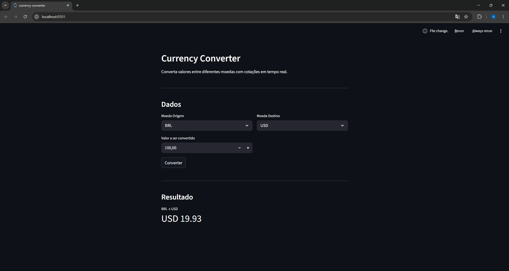

# 💱 Currency Converter

Converta valores entre diferentes moedas com cotações em tempo real.

## 📸 Screenshot



## ✨ Funcionalidades

- 🌍 Suporte a mais de 150 moedas
- 📡 Cotações em tempo real via ExchangeRate-API
- 💰 Resultado formatado no padrão internacional

## 🛠️ Tecnologias

- [Python 3.10+](https://www.python.org/)
- [Streamlit](https://streamlit.io/)
- [Requests](https://requests.readthedocs.io/)
- [ExchangeRate-API](https://www.exchangerate-api.com/)

## 📁 Estrutura do Projeto

```
currency-converter/
│
├── app.py            # Interface com Streamlit
├── api.py            # Chamadas à ExchangeRate-API
├── utils.py          # Formatação de valores
├── .env              # Chave de API (não vai pro GitHub)
├── requirements.txt  # Dependências
└── README.md
```

## 🚀 Como rodar

**1 — Clone o repositório**
```bash
git clone https://github.com/gabrieldosantosribeiro/currency-converter.git
cd currency-converter
```

**2 — Crie e ative um ambiente virtual**
```bash
python -m venv .venv

# Windows
.venv\Scripts\Activate.ps1

# Mac/Linux
source .venv/bin/activate
```

**3 — Instale as dependências**
```bash
pip install -r requirements.txt
```

**4 — Configure a chave de API**

Crie um arquivo `.env` na raiz do projeto:
```
API_KEY=sua_chave_aqui
```

Obtenha sua chave gratuita em [exchangerate-api.com](https://www.exchangerate-api.com/)

**5 — Rode o app**
```bash
streamlit run app.py
```

O app vai abrir automaticamente em `http://localhost:8501`

## 👨‍💻 Autor

Feito com 💙 como projeto de aprendizado de Python e Streamlit.